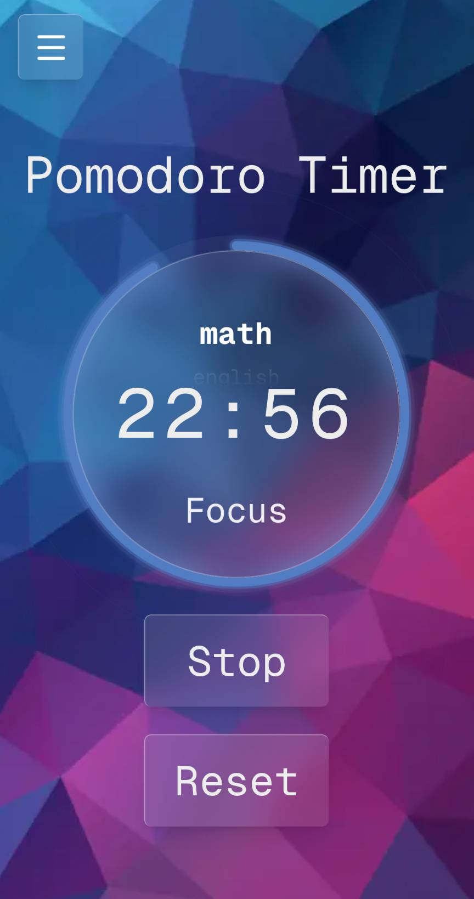
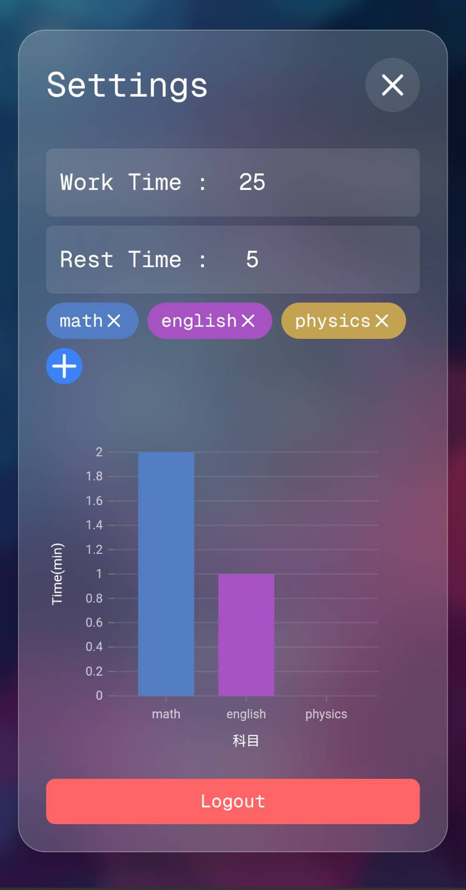
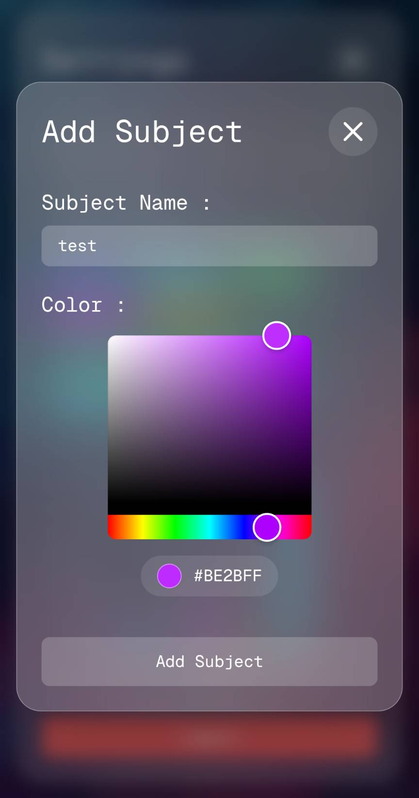

<div align="center">

# Pomodoro Timer

**作業時間を科目ごとに記録・可視化する、ポモドーロ・テクニック向けタイマー**

[](https://nextjs.org)
[](https://react.dev)
[](https://www.typescriptlang.org)
[](https://tailwindcss.com)
[](https://supabase.com)
[](https://vercel.com)

**▶ Live Demo: https://pomodoro-timer-glass-morphism.vercel.app/**

</div>

---

## 背景・課題

塾講師のアルバイトで、勉強に集中し続けられない生徒を多く見てきました。短い集中と休憩を繰り返すポモドーロ・テクニックがこの課題に有効だと考えましたが、実際に使おうとすると次の問題に行き当たりました。

- 既存の Web ポモドーロタイマーは**タイマー機能だけ**で、「どの科目をどれだけ勉強したか」が残らない。
- そのため、生徒も自分も**学習量を振り返って改善する**ことができない。
- 1回の勉強で複数科目を行き来するのに、**科目を切り替えながら時間を記録**できるツールがない。

集中の習慣化と、学習量の可視化による振り返り——この両方を1つで満たすツールが必要でした。

## 解決アプローチ

そこで「集中のためのタイマー」に「科目ごとの学習記録」を統合した Web アプリとして制作しました。

- **科目別に作業時間を記録・可視化** — 科目を登録し、ポモドーロのセッションを科目ごとに集計。棒グラフでどの科目にどれだけ取り組んだかを振り返れる。
- **作業を止めずに科目を切り替え** — 勉強の途中で科目を切り替えても、時間がその時点までの科目に正しく計上される。複数科目を行き来する実際の勉強スタイルに合わせた。
- **どこでも続けられる** — Google ログインで記録をクラウド保存し、スマホでもPCでも同じ記録にアクセスできる。習慣化を後押しする。

---

## 概要

ポモドーロ・テクニック（25分作業 + 5分休憩）で集中を管理し、**「どの科目に・どれだけ取り組んだか」を記録してグラフで振り返る**ことができる Web アプリです。Google ログインでユーザーごとに作業ログが保存され、複数デバイスから同じ記録にアクセスできます。

UI は Glass Morphism（すりガラス風）で、ボタン・ピッカー・モーダルなどを自作コンポーネントとして実装しています。

---

## スクリーンショット

<p align="center">
  
  
  
</p>

<p align="center">
  <em>左から：タイマー（円形プログレス＋科目選択） / 科目別の作業時間グラフ / 科目の追加・色設定</em>
</p>

---

## 主な機能

- **ポモドーロタイマー**: 作業／休憩時間をドラムピッカーで設定。円形プログレスで残り時間を表示。
- **科目別の時間記録**: 科目（名前 + 色）を登録し、作業セッションを科目ごとに計測・保存。
- **作業時間の可視化**: 蓄積した作業記録を科目別の棒グラフで振り返り。
- **Google ログイン**: Supabase Auth による認証。ユーザーごとに科目・記録を分離して保存。
- **バックグラウンドでも正確な計測**: タブが非アクティブでも作業時間がずれない（後述）。

---

## 技術スタック

| カテゴリ | 技術 |
|---|---|
| フレームワーク | Next.js 16 (App Router) / React 19 |
| 言語 | TypeScript |
| スタイリング | Tailwind CSS |
| 認証・DB | Supabase (Auth / PostgreSQL) |
| グラフ | Nivo |
| UI 補助 | lucide-react / react-hot-toast / react-colorful |
| デプロイ | Vercel |

---

## 設計のポイント

### 1. middleware による SSR 認証ガード

`middleware.ts` で `@supabase/ssr` を使い、サーバーサイドでセッションを検証してからページを返す。未ログインで保護ページにアクセスした場合は `/login` へ、ログイン済みで `/login` にアクセスした場合は `/` へリダイレクトする。クライアント側の描画を待たずにアクセス制御できる。

### 2. タイムスタンプ方式によるバックグラウンド計測

`setInterval` のカウントは、ブラウザが非アクティブタブで間引くため、タブを離れると経過時間がずれる。これを避けるため、**開始時刻（`Date.now()`）と累積時間から経過を都度算出**する方式にしている。表示更新はインターバルで行いつつ、記録される作業時間は実時刻ベースなので、タブを切り替えても計測が正確に保たれる。

### 3. Glass Morphism の自作コンポーネント

`GlassButton` / `DrumPicker` / `Modal` / `Badge` などを自前で実装し、すりガラス風の統一された UI を構築している。

---

## ローカル開発

```bash
# 1. 依存をインストール
npm install

# 2. 環境変数を設定（Supabase プロジェクトの値）
#    .env.local を作成し以下を記述
# NEXT_PUBLIC_SUPABASE_URL=...
# NEXT_PUBLIC_SUPABASE_ANON_KEY=...

# 3. 開発サーバー起動
npm run dev
# http://localhost:3000
```

Supabase 側には `subjects`（id / name / color / user_id）と `work_records`（id / subject_id / duration / user_id / created_at）のテーブルが必要です。

---

## ライセンス

個人開発のポートフォリオ用プロジェクトです。
